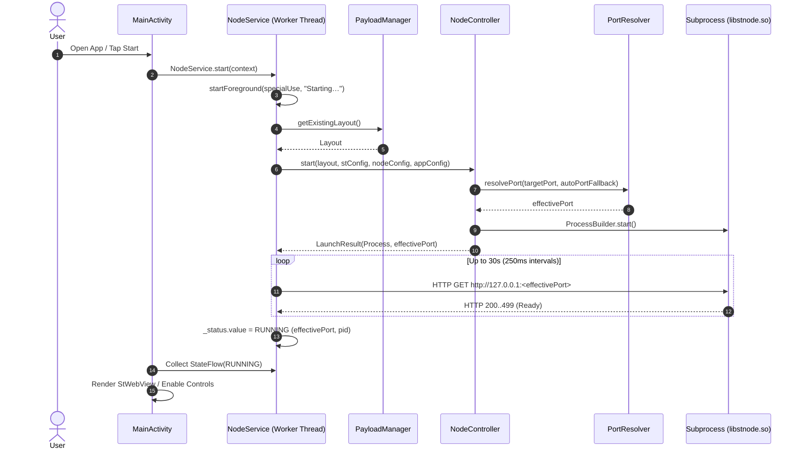
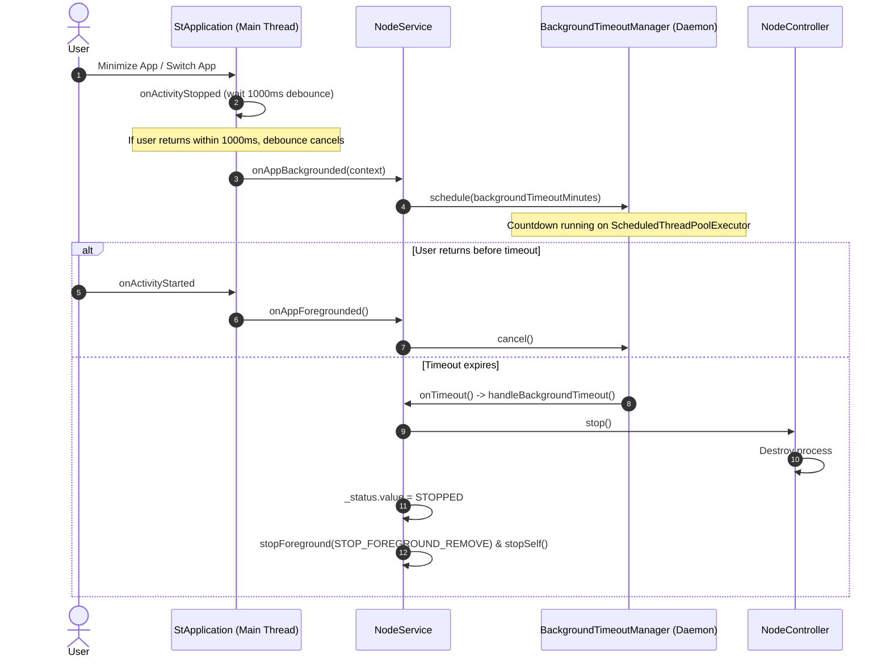

# ST Mobile architecture

A high-level map of how the app is organised. For the runtime contract, on-device layout, build
pipeline and the reasoning behind each choice, see [`technical-breakdown.md`](technical-breakdown.md).

---

## 1. Overview

ST Mobile runs [SillyTavern](https://github.com/SillyTavern/SillyTavern) locally on Android. It
embeds a Node.js runtime (`nodejs-mobile`) as a native shared library, launches the server as an
independent subprocess, and supervises that process from an Android `specialUse` foreground service.
A Jetpack Compose shell hosts the UI and a WebView pointed at the local server.

## 2. Packages

| Package | Responsibility |
| :--- | :--- |
| `app.stmobile` | `MainActivity` (lifecycle coordinator and backup file contracts), `StApplication` (foreground/background tracking), `AppPaths` (every filesystem path), `Utils` (battery prompt, notification permission, log sharing). |
| `models` | Typed configuration and state: `AppConfig` (app settings), `StConfig` (SillyTavern `config.yaml`), `NodeConfig` (V8 and environment options), `NodeStatus` (lifecycle state). |
| `node` | Process supervision: `NodeService` (foreground service and status flow), `NodeController` (launches and stops the process), `PortResolver` (port probing and fallback), `BackgroundTimeoutManager` (idle shutdown). |
| `sillytavern` | `PayloadManager` (unpacks the bundled SillyTavern) and `BackupManager` (export, import, restore of user data). |
| `ui` | Compose screens: setup, dashboard, settings, the WebView host, backup dialogs, and navigation. |

### Dependency rules

1. `models` is a leaf: it depends on nothing else in the app.
2. `sillytavern` depends only on `AppPaths` and the Android framework.
3. `node` orchestrates `models` and `sillytavern` to launch and supervise the server. It exposes a
   process-level `StateFlow<NodeStatus>`, so the UI never binds to the service.
4. `ui` and `MainActivity` observe that flow and read or write settings through the `models` classes.

## 3. Key lifecycles

### Server launch

### Background timeout

## 4. Data and backups

User state (`config/config.yaml` and `data/`) is kept apart from the replaceable SillyTavern tree
(`st/`), so a payload update never touches it. `BackupManager` exports that state to a ZIP, with
optional AES-256 encryption, and restores it either as a clean replace (with rollback on failure) or
as a merge. `StConfig` edits `config.yaml` without dropping keys it does not know about.

## 5. Testing

- **Host JVM unit tests** (`src/test`): run with `./gradlew testDebugUnitTest`, no emulator needed.
  They cover configuration persistence and clamping, port resolution, the background timeout,
  backup and restore, YAML sync, and screen routing.
- **Emulation and device tests** (`src/androidTest`): planned, not implemented yet.
