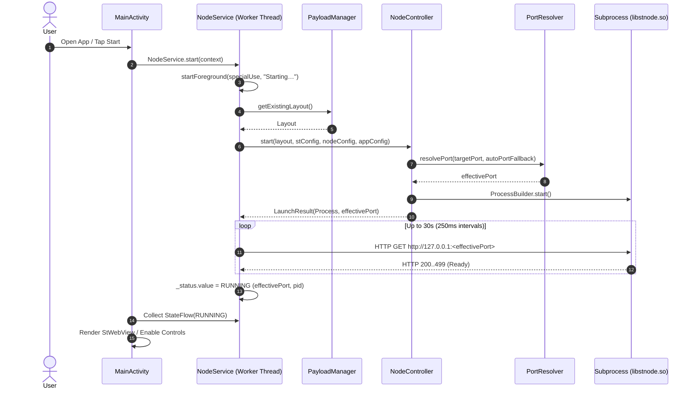
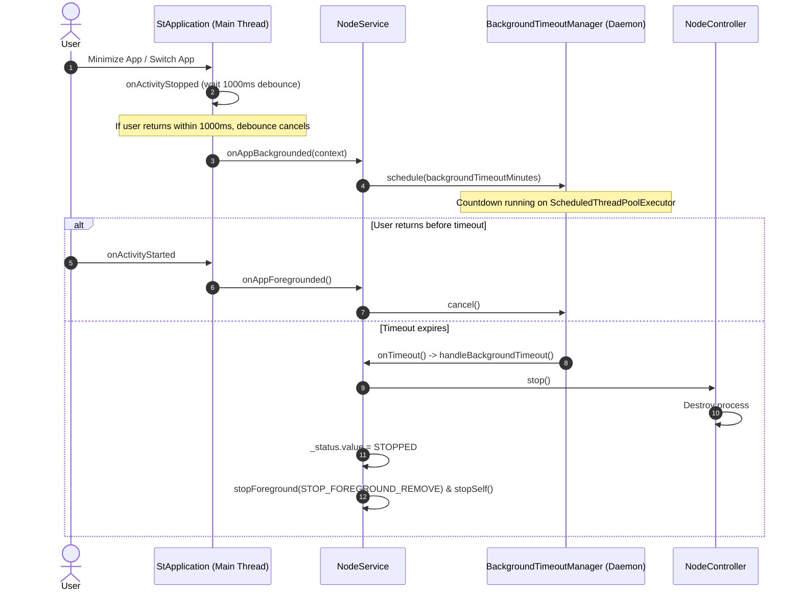

# ST Mobile architecture

A high-level map of how the app is organised. For the runtime contract, on-device layout, build
pipeline and the reasoning behind each choice, see [`technical-breakdown.md`](technical-breakdown.md).
For the 3-tier testing framework, testable seams, and validation contracts, see [`testing.md`](testing.md).

---

## 1. Overview

ST Mobile runs [SillyTavern](https://github.com/SillyTavern/SillyTavern) locally on Android. It
embeds a Node.js runtime (`nodejs-mobile`) as a native shared library, launches the server as an
independent subprocess, and supervises that process from an Android `specialUse` foreground service.
A Jetpack Compose shell hosts the UI and a WebView pointed at the local server.

## 2. Packages

| Package | Responsibility |
| :--- | :--- |
| `app.stmobile` | `MainActivity` (lifecycle coordinator and backup file contracts), `StApplication` (foreground/background tracking), `AppPaths` (every filesystem path), `Utils` (battery prompt, notification permission, log sharing). |
| `models` | Typed configuration and state: `AppConfig` (app settings), `StConfig` (SillyTavern `config.yaml`), `NodeConfig` (V8 and environment options), `NodeStatus` (lifecycle state). |
| `node` | Process supervision: `NodeService` (foreground service and status flow), `NodeController` (launches and stops the process), `PortResolver` (port probing and fallback), `BackgroundTimeoutManager` (idle shutdown). |
| `sillytavern` | `PayloadManager` (unpacks the bundled SillyTavern) and `BackupManager` (export, import, restore of user data). |
| `ui` | Compose screens: setup, dashboard, settings, WebView host with edge-docked quick toolbar and gesture exclusion, backup dialogs, and navigation state machine (`computeNextScreen`, `computeBackScreen`). |

### Dependency rules

1. `models` is a leaf: it depends on nothing else in the app.
2. `sillytavern` depends only on `AppPaths` and the Android framework.
3. `node` orchestrates `models` and `sillytavern` to launch and supervise the server. It exposes a
   process-level `StateFlow<NodeStatus>`, so the UI never binds to the service.
4. `ui` and `MainActivity` observe that flow and read or write settings through the `models` classes.

## 3. Key lifecycles

### Server launch

### Background timeout

### Screen routing and window insets contract

Top-level navigation and system insets follow a strict pure contract:
- **`computeNextScreen`**: Automatically navigates from `DASHBOARD` to `WEBVIEW` when the server reports `RUNNING` (if `autoLaunchWebViewOnStart` is enabled), and returns to `DASHBOARD` if the server stops or encounters an error. Active configuration sessions on `SETTINGS` or `SETUP` are preserved without interruption.
- **`computeBackScreen`**: Tracks navigation origin so entering Settings via the WebView quick toolbar returns directly to `WEBVIEW` on Back (provided the server remains `RUNNING`), otherwise falling back to `DASHBOARD`.
- **Gesture exclusion & soft keyboard insets**: The right-edge docked menu handle registers Android system gesture exclusion rects (`Modifier.systemGestureExclusion()`) to prevent conflict with system back-swipes, while all scroll containers apply `Modifier.imePadding()` to ensure text fields remain unobstructed by the on-screen keyboard.

## 4. Data and backups

User state (`config/config.yaml` and `data/`) is kept apart from the replaceable SillyTavern tree
(`st/`), so a payload update never touches it. `BackupManager` exports that state to a ZIP, with
optional AES-256 encryption, and restores it either as a clean replace (with rollback on failure) or
as a merge. `StConfig` edits `config.yaml` without dropping keys it does not know about.

## 5. Testing

ST Mobile employs a rigorous three-tier testing strategy designed to provide rapid developer feedback, enforce native artifact invariants in CI, and verify execution integrity on physical ARM64 hardware without compromising user data:

- **Tier 1: Host JVM Unit Tests** (`src/test/java/app/stmobile/`): 90 pure JVM tests across 10 classes executed in ~500ms via `./gradlew testDebugUnitTest`. Tests run completely isolated from Android runtime dependencies using inverted dependency constructors, covering payload extraction transactions, launch specs, readiness polling, non-destructive YAML parsing, navigation routing, and backup cryptography.
- **Tier 2: Static Native APK Inspection** (`ci/check_apk.sh`): 7 automated APK auditing checks verifying that native libraries (`libstnode.so`, `libnode.so`, `libc++_shared.so`) match ELF64/AArch64 targets, DT_NEEDED dependencies are strictly satisfied, ELF load segments meet Android 15 16 KB page alignment, payload assets match SHA-256 manifests, and DEX bytecode is free of unstripped development strings.
- **Tier 3: Physical Device Smoke Tests** (`src/androidTest/java/app/stmobile/`): 4 hardware instrumentation tests across 3 classes executed via `ci/run_device_tests.sh` on connected ARM64 devices (or via wireless ADB). Tests exercise sandboxed payload extraction, native Node.js process execution under Android SELinux / W^X constraints, and loopback HTTP socket readiness and restart recovery.

For complete test inventories, architectural seams, failure simulation details, and execution instructions, see the dedicated [Testing Architecture & Verification Guide](testing.md).

