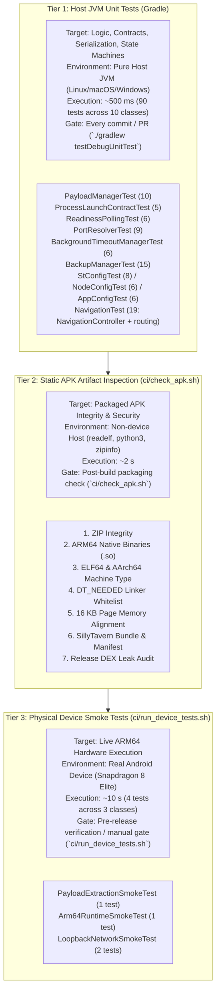
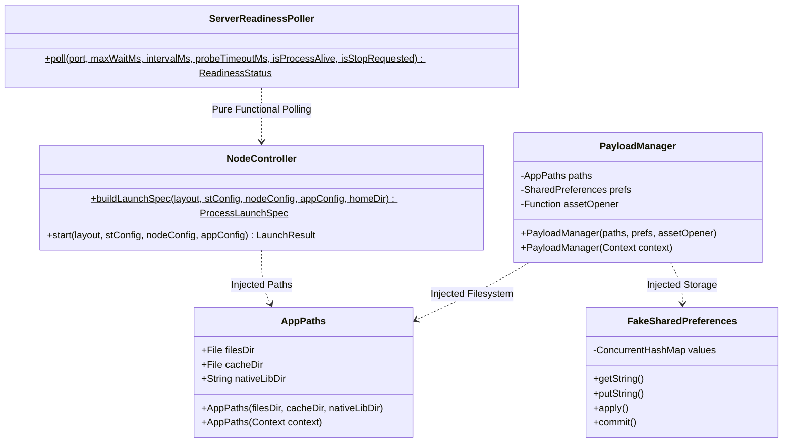
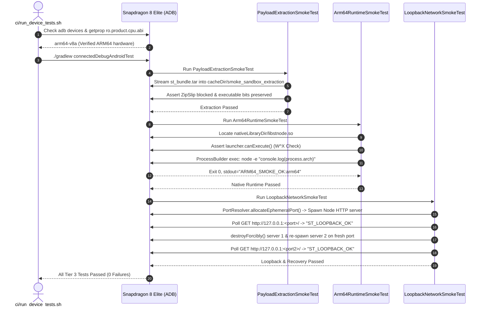

# ST Mobile: Testing Architecture & Technical Reference

A comprehensive technical reference for ST-Mobile's layered validation framework. The high-level map is in [`architecture.md`](architecture.md), and the runtime and build details are in [`technical-breakdown.md`](technical-breakdown.md). This document explains the testing strategy, testable architecture seams, individual test suites, APK static inspection checks, and on-device ARM64 hardware smoke tests.

---

## 1. Overview & Testing Philosophy

ST-Mobile embeds a prebuilt Node.js runtime (`libnode.so` and launcher `libstnode.so`) alongside an uncompressed SillyTavern web application (`st_bundle.tar`). 

### Why Emulation Is Out of Scope
`libstnode.so` is compiled exclusively for **`arm64-v8a`** (AArch64). Standard x86 Android emulators and container environments cannot execute ARM64 binaries without software translation layers (like libndk_translation or QEMU), which are either unavailable in standard CI, unacceptably slow, or yield false positives regarding dynamic linking, 16 KB page memory alignment, and SELinux loopback socket behavior.

### Why Robolectric Was Avoided
Robolectric simulates the Android OS on host JVMs by downloading multi-hundred-megabyte prebuilt `android-all` framework jars over the network and maintaining heavy shadow DOM/reflection trees. In ST-Mobile, test iterations must execute in milliseconds on every commit without external network dependencies. By introducing lightweight **constructor inversion seams** (`AppPaths`, `PayloadManager`, `NodeController.buildLaunchSpec`, and `FakeSharedPreferences`), 100% of the app's business logic, archive management, process launch contracts, and state machines are validated on pure host JVMs in **under 500 milliseconds**.

### The Three-Tier Matrix



---

## 2. Tier 1: Host JVM Unit Tests Breakdown

Tier 1 executes via `./gradlew testDebugUnitTest`. All tests reside in `src/test/java/app/stmobile/`.

```
src/test/java/app/stmobile/
├── models/
│   ├── AppConfigTest.kt           (6 tests)
│   ├── NodeConfigTest.kt          (6 tests)
│   └── StConfigTest.kt            (8 tests)
├── node/
│   ├── BackgroundTimeoutManagerTest.kt (6 tests)
│   ├── PortResolverTest.kt        (9 tests)
│   ├── ProcessLaunchContractTest.kt    (5 tests)
│   └── ReadinessPollingTest.kt    (6 tests)
├── sillytavern/
│   ├── BackupManagerTest.kt       (15 tests)
│   └── PayloadManagerTest.kt      (10 tests)
├── testutils/
│   └── FakeSharedPreferences.kt   (Architectural test double)
└── ui/
    └── NavigationTest.kt          (19 tests)
```

### 2.1 `sillytavern/PayloadManagerTest.kt` (10 tests)
Tests the lifecycle of the bundled application payload: first-run extraction, manifest version parsing, payload upgrade preservation, archive truncation, low-space rollbacks, checksum verification, and ZipSlip path traversal protection.

| Test Method | Architectural Role |
| :--- | :--- |
| `testExtractionNeededWhenNotInstalled` | Verifies `isExtractionNeeded()` returns `true` on a clean install when SharedPreferences lacks `installed_payload_version`. |
| `testFirstRunExtractionSuccess` | Validates streaming extraction from assets, executable permission bits (`0755`), default `config.yaml` seeding, symlink creation, and installation stamp recording. |
| `testExtractionNeededWhenManifestVersionUpdated` | Simulates an app upgrade where `payload_manifest.json` reports a newer version, triggering `isExtractionNeeded() == true`. |
| `testExtractionNeededWhenEntryFileMissing` | Verifies self-healing: if `st/server.js` is deleted, extraction is re-triggered even if SharedPreferences records an installed version. |
| `testReExtractionAfterUpdatePreservesUserDataAndConfig` | **Critical safety test:** Upgrades payload to `v2.0.0` and asserts that user-created characters in `data/characters/` and modified `config/config.yaml` remain intact while `st/` is updated atomically. |
| `testTruncatedTarThrowsAndCleansUp` | Feeds a truncated tar archive stream (sliced at 33% length); asserts exception is thrown, staging directory `st_new` is purged, and version stamp is not saved. |
| `testLowSpaceIOExceptionCleansUp` | Simulates an out-of-disk condition (`IOException("No space left on device")`) mid-stream; asserts clean rollback of `st_new`. |
| `testChecksumMismatchThrowsAndCleansUp` | Provides a valid tar but corrupts the manifest `bundle_sha256`; asserts `IllegalStateException`, `st_new` cleanup, and abort. |
| `testZipSlipPathTraversalBlocked` | Injects an archive entry named `st/../../outside.txt`; asserts `IllegalStateException("Unsafe archive entry")` is thrown via `safeResolve`. |
| `testResetPayload` | Verifies that manual payload reset deletes `st/` and clears the installation version stamp while preserving user directories. |

### 2.2 `node/ProcessLaunchContractTest.kt` (5 tests)
Validates the exact command line, environment variables, working directory, and port selection handed to the operating system when spawning `libstnode.so`.

| Test Method | Architectural Role |
| :--- | :--- |
| `testCommandLineArgumentsOrdering` | Verifies strict POSIX argument order: argv[0] (`launcher`) $\to$ V8 runtime options (`--max-old-space-size=1024`, `--expose-gc`) $\to$ entry script (`server.js`) $\to$ SillyTavern CLI arguments (`--configPath`, `--dataRoot`, `--browserLaunchEnabled false`, `--port`). |
| `testWorkingDirectoryAndLogRedirection` | Asserts working directory equals `layout.stDir`, and stdout/stderr point to `node_stdout.log` and `node_stderr.log` under `filesDir/logs/`. |
| `testEnvironmentVariablesContract` | Asserts all required POSIX environment variables are populated: `LD_LIBRARY_PATH`, `HOME`, `TMPDIR`, `TMP`, `TEMP`, `NODE_ENV`, `TZ`, `SILLYTAVERN_PORT`, `ST_ANDROID=1`, `NODE_OPTIONS`, and custom `extraEnv`. |
| `testBasicAuthOmittedWhenDisabled` | Asserts that `SILLYTAVERN_BASICAUTHMODE`, `SILLYTAVERN_BASICAUTHUSER_USERNAME`, and `SILLYTAVERN_BASICAUTHUSER_PASSWORD` are excluded from the environment when Basic Auth is turned off. |
| `testPortConflictAutoFallbackSelection` | Binds a live dummy socket on 127.0.0.1; asserts that with `autoPortFallback = true`, `buildLaunchSpec` resolves to an alternative kernel-assigned free port and updates both `--port` and `SILLYTAVERN_PORT`. |

### 2.3 `node/ReadinessPollingTest.kt` (6 tests)
Validates `ServerReadinessPoller` against in-process fake HTTP servers using standard `ServerSocket`.

| Test Method | Architectural Role |
| :--- | :--- |
| `testServerReadyImmediately` | Validates immediate HTTP 200 resolution without polling delay. |
| `testServerReadyWithAuthOrNotFoundHttpCodes` | Verifies that HTTP 401 (Basic Auth challenged) and HTTP 404 report `ReadinessStatus.READY`, confirming that Node/Express is listening. |
| `testServerDelayedStartup` | Starts the server in a background thread after a 120ms delay; asserts that poller retries and returns `READY` once listening. |
| `testServerTimeoutWhenPortUnopened` | Probes an unopened port; asserts `ReadinessStatus.TIMEOUT` occurs after `maxWaitMs`. |
| `testProcessDiedAbortsPollingImmediately` | Tests early cancellation: passing `isProcessAlive = { false }` aborts polling in <500ms rather than stalling for 30 seconds. |
| `testStopRequestedAbortsPollingImmediately` | Tests user stop: passing `isStopRequested = { true }` immediately cancels polling and returns `ReadinessStatus.CANCELLED`. |

### 2.4 `node/PortResolverTest.kt` (9 tests)
Validates port probing, `SO_REUSEADDR` socket binding, and automatic fallback assignment.

| Test Method | Architectural Role |
| :--- | :--- |
| `testPortAvailableWhenFree` | Allocates an ephemeral port, verifies availability, and confirms 1:1 resolution. |
| `testPortConflictWithAutoFallback` | Binds a server socket; asserts that `resolvePort` with `autoFallback = true` assigns a distinct free port. |
| `testPortConflictWithoutAutoFallback` | Asserts that an occupied port throws `PortInUseException` when fallback is disabled. |
| `testPortBoundaryEdgeCasesAvailability` | Asserts that ports 0, 65536, -1, and 100000 report as unavailable. |
| `testValidBoundaryPortFallbackWhenOccupiedOrPrivileged` | Verifies fallback handling for privileged port 1 and maximum valid port 65535. |
| `testPortZeroThrowsWhenNoFallback` | Asserts `IllegalArgumentException` when port 0 is requested with fallback disabled. |
| `testPortAbove65535ThrowsWhenNoFallback` | Asserts `IllegalArgumentException` when port 65536 is requested with fallback disabled. |
| `testNegativePortThrowsWhenNoFallback` | Asserts `IllegalArgumentException` for negative port numbers when fallback disabled. |
| `testOutOfBoundsPortsFallbackWhenEnabled` | Asserts that requesting port 0, 65536, or negative ports with fallback enabled safely resolves to an ephemeral port. |

### 2.5 `node/BackgroundTimeoutManagerTest.kt` (6 tests)
Validates idle background shutdown scheduling via `ScheduledThreadPoolExecutor`.

| Test Method | Architectural Role |
| :--- | :--- |
| `testTimeoutTriggered` | Verifies that timeout callback is invoked upon expiration and state is cleared. |
| `testTimeoutCancelled` | Cancels a running timer; asserts callback is never invoked. |
| `testZeroOrNegativeTimeoutDisabled` | Asserts that $\le 0$ timeout values disable scheduling entirely. |
| `testRescheduleOverridesPrevious` | Replaces an active timer with a shorter delay; asserts only the rescheduled task fires. |
| `testZeroDaemonLeaksAndImmediateQueuePurge` | Verifies that `removeOnCancelPolicy = true` purges cancelled tasks from executor queues immediately, preventing memory leaks. |
| `testShutdownTerminatesSchedulerCleanly` | Asserts clean termination and thread exit on service destruction. |

### 2.6 `sillytavern/BackupManagerTest.kt` (15 tests)
Validates data export, import, preflight inspection, AES-256 encryption, and atomic restore.

| Test Method | Architectural Role |
| :--- | :--- |
| `testExportUnencryptedArchiveWithManifest` | Exports data + config to ZIP; asserts `backup_manifest.json` matches format. |
| `testExportAes256EncryptedArchive` | Exports with password; verifies Zip4j AES-256 encryption and read failures without password. |
| `testInspectionPreflightUnencrypted` | Inspects ZIP without unpacking; reads manifest and validates structure. |
| `testInspectionPreflightEncryptedAndValidation` | Preflights encrypted archive: detects encryption, tests wrong password rejection, unlocks with correct password. |
| `testCleanRestoreAtomicReplacement` | Clean restore purges stale local files and replaces tree atomically. |
| `testCleanRestoreOnFreshDevice` | Clean restore succeeds when target directories do not exist yet. |
| `testMergeRestorePreservesLocalFiles` | Merge restore preserves unmentioned local files while overwriting conflicting files. |
| `testZipSlipVulnerabilityRejection` | Asserts `SecurityException` when importing archives with `data/../../` entries. |
| `testRestoreLegacyArchiveWithoutManifest` | Validates backwards-compatibility: imports raw archives lacking manifests. |
| `testCorruptedZipInspection` | Asserts empty or non-ZIP files report `isValid == false`. |
| `testExportEmptyDataDir` | Asserts zero-byte data directories export valid manifests with `fileCount == 0`. |
| `testExportAndInspectionWithVersionCodeOnly` | Verifies version stamping when `versionName` is null and only `versionCode` exists. |
| `testResolveVersionLogic` | Verifies precedence: non-blank `versionName` takes priority; blank falls back to `versionCode`. |
| `testDefaultConstructorAppVersionIsOne` | Asserts default fallback version is `"1"`. |
| `testAtomicDirectoryPromotionWhenParentMissing` | Validates restore into deeply nested non-existent directories. |

### 2.7 `models/StConfigTest.kt` (8 tests)
Validates two-way SnakeYAML synchronization for SillyTavern's `config.yaml`.

| Test Method | Architectural Role |
| :--- | :--- |
| `testParseDefaultsAndPreserveUnknownKeys` | Verifies typed accessors and asserts that unknown YAML keys and comments survive serialize/deserialize cycles. |
| `testSafeTypeCoercion` | Asserts string ports (`"8085"`) and string booleans (`"true"`) coerce safely to typed fields. |
| `testAtomicFileSaveAndReload` | Verifies atomic file write using `.tmp` and atomic replace (`StandardCopyOption.ATOMIC_MOVE`). |
| `testServerPluginsAndSkipContentCheckProperties` | Tests `enableServerPlugins` and `skipContentCheck` properties. |
| `testFromFileOrDefaultBehavior` | Tests fallback: invokes default provider when file is absent; reads disk file directly when present. |
| `testEmptyOrNonMapYamlHandling` | Asserts empty strings and scalar YAML gracefully fallback to defaults. |
| `testDeepNestedPathCreationOverwritingPrimitive` | Asserts `setPath("a.b.c", value)` promotes primitive scalar nodes to structured maps. |
| `testWhitelistModifications` | Tests mutation and block-formatting of IPv4/IPv6 client whitelists. |

### 2.8 `models/NodeConfigTest.kt` (6 tests)
Validates V8 runtime configuration and memory limits.

| Test Method | Architectural Role |
| :--- | :--- |
| `testClampedMemoryLimits` | Verifies that `--max-old-space-size` is clamped between 256 MB and 4096 MB. |
| `testToNodeOptions` | Validates formatting of `NODE_OPTIONS` string from option lists. |
| `testDefaultTimezone` | Asserts that device default timezone is non-blank. |
| `testSharedPreferencesFallbackDefaults` | Tests default values when SharedPreferences is empty. |
| `testSharedPreferencesSerializationRoundTrip` | Round-trip tests JSON serialization of extra options and environment maps. |
| `testMemoryLimitClampingOnSave` | Asserts that clamping is enforced at save time into SharedPreferences. |

### 2.9 `models/AppConfigTest.kt` (6 tests)
Validates application preferences and upgrade migration semantics.

| Test Method | Architectural Role |
| :--- | :--- |
| `testDefaultValues` | Asserts defaults: auto-start false, auto-launch true, timeout 5m, auto-port fallback true. |
| `testMutationsAndPersistence` | Mutates all preferences and verifies reload on independent instances. |
| `testSafeNumericalClampingForBackgroundTimeout` | Asserts that negative background timeouts clamp to 0 (disabled). |
| `testUpgradeSemantics_unwrittenKeysAdoptNewDefaults` | Simulates an older install; asserts unwritten keys adopt modern defaults. |
| `testUpgradeSemantics_explicitUserOverridesPreserved` | Asserts that user-modified settings survive app updates. |
| `testUpgradeSemantics_mutationOfUnwrittenKeyPersists` | Mutating an unwritten key writes it to SharedPreferences and persists across reloads. |

### 2.10 `ui/NavigationTest.kt` (19 tests)
Validates both pure screen transition routing and the stateful `NavigationController` backstack machine.

| Test Group | Tests Included | Architectural Role |
| :--- | :--- | :--- |
| **ActiveScreen Enum** (1) | `testActiveScreenEnumValues` | Verifies `ActiveScreen` enum values: `SETUP`, `DASHBOARD`, `SETTINGS`, `WEBVIEW`. |
| **Pure Next-Screen Transitions** (8) | `testComputeNextScreen_autoLaunchOnRunning`<br/>`testComputeNextScreen_disabledAutoLaunch`<br/>`testComputeNextScreen_serverStoppedFromWebView`<br/>`testComputeNextScreen_serverErrorFromWebView`<br/>`testComputeNextScreen_serverStartingFromWebView`<br/>`testComputeNextScreen_preservesSettingsOnRunning`<br/>`testComputeNextScreen_preservesSetupOnRunning`<br/>`testComputeNextScreen_restartFlapHandling` | Pure function `computeNextScreen`: automatically launches `WEBVIEW` when server reaches `RUNNING` (if auto-launch enabled), returns to `DASHBOARD` on stop/error/starting, preserves configuration screens without interruption, and safely handles server restart flapping without getting stuck. |
| **NavigationController & BackStack Machine** (10) | `testNavController_quickToolbarDashboardThenBackReturnsToWebView`<br/>`testNavController_quickToolbarSettingsThenBackReturnsToWebView`<br/>`testNavController_fullBackStackMultiHop`<br/>`testNavController_tabToggleDeduplication`<br/>`testNavController_rootDashboardExits`<br/>`testNavController_serverStoppedSkipsDeadWebView`<br/>`testNavController_snapshotSaveAndRestore`<br/>`testNavController_exitWebViewToDashboardClearsStackAndExitsOnNextBack`<br/>`testNavController_exitWebViewToDashboard_multiHopThroughSettingsUnwindsToExit`<br/>`testNavController_exitWebViewToDashboard_reopenWebViewResetsLifecycle` | Stateful `NavigationController`: manages backstack history, quick toolbar origin returns to WebView on Back, multi-hop stack unwinding, tab deduplication, process death state preservation via `NavigationSnapshot`, and safe fallback skipping dead WebView when server is stopped. |

### 2.11 `testutils/FakeSharedPreferences.kt` (Test Double)
An in-memory, thread-safe implementation of Android's `SharedPreferences` and `SharedPreferences.Editor` using `ConcurrentHashMap`. Enables testing preference reads, writes, batch updates (`apply()` / `commit()`), and upgrade semantics on standard JVMs without Android mocks or Robolectric.

---

## 3. Architectural Seams & Inversions



To eliminate heavy Android dependencies in tests, the codebase implements four architectural seams:

1. **Constructor Inversion in `AppPaths`:**
   ```kotlin
   class AppPaths(val filesDir: File, val cacheDir: File, val nativeLibDir: String) {
       constructor(context: Context) : this(
           filesDir = context.filesDir,
           cacheDir = context.cacheDir,
           nativeLibDir = context.applicationInfo.nativeLibraryDir,
       )
   }
   ```
   Pure parameter constructor is primary; Android `Context` constructor is secondary.

2. **Constructor Inversion in `PayloadManager`:**
   ```kotlin
   class PayloadManager(
       private val paths: AppPaths,
       private val prefs: SharedPreferences,
       private val assetOpener: (String) -> InputStream,
   ) {
       constructor(context: Context) : this(
           paths = AppPaths(context),
           prefs = context.getSharedPreferences("payload", Context.MODE_PRIVATE),
           assetOpener = { name -> context.assets.open(name) },
       )
   }
   ```
   Enables tests to inject temporary directories and synthetic byte-stream assets.

3. **Pure Launch Specification Factory in `NodeController`:**
   `NodeController.buildLaunchSpec(...)` is a pure function decoupled from process execution. Tests assert on the generated `ProcessLaunchSpec` without spawning processes.

4. **Supplier-Based Polling in `ServerReadinessPoller`:**
   Probing accepts `isProcessAlive: () -> Boolean` and `isStopRequested: () -> Boolean` functional suppliers, enabling sub-millisecond cancellation testing.

---

## 4. Critical Platform Bug Fixes & Lessons Learned

### 4.1 The Directory Symlink Deletion Trap (`safeDeleteRecursively`)

```mermaid
flowchart TD
    subgraph Vulnerable["Default Kotlin: File.deleteRecursively()"]
        V_Root["deleteRecursively('filesDir/st')"]
        V_Sym["Traverses 'st/data' symlink via File.listFiles()"]
        V_Wipe["DELETES REAL USER DATA in 'filesDir/data/'! ❌"]
        V_Root --> V_Sym --> V_Wipe
    end

    subgraph Hardened["Hardened: PayloadManager.safeDeleteRecursively()"]
        H_Root["Files.walkFileTree('filesDir/st', NO_FOLLOW_LINKS)"]
        H_Visitor["SimpleFileVisitor.visitFile()"]
        H_Sym["Encounter symlink 'st/data' -> attrs.isSymbolicLink() == true"]
        H_Del["Files.deleteIfExists(symlink) (Deletes link ONLY) ✅"]
        H_Safe["User data in 'filesDir/data/' remains 100% intact!"]
        H_Root --> H_Visitor --> H_Sym --> H_Del --> H_Safe
    end
```



* **Vulnerability:** SillyTavern creates symlinks inside the application tree pointing to user state: `st/data -> filesDir/data` and `st/config.yaml -> filesDir/config/config.yaml`. In standard Java/Kotlin, `File.deleteRecursively()` uses `File.listFiles()`, which traverses into symbolic links. Swapping `st_old` during a payload upgrade or reset silently wiped all user chats, characters, and settings!
* **Fix:** Implemented `PayloadManager.safeDeleteRecursively()` using Java NIO `Files.walkFileTree()` with `SimpleFileVisitor`. By default, `walkFileTree` does **not** follow links: symlinks are visited as leaf files via `visitFile` and deleted with `Files.deleteIfExists()`, unlinking the pointer without deleting the target directory.

### 4.2 Bash Pipeline SIGPIPE Trap (`set -o pipefail`)
* **Vulnerability:** In `ci/check_apk.sh`, using `set -eo pipefail` caused commands like `unzip -l "$APK" | grep -q "entry"` to fail with exit code 141. `grep -q` closes the pipe immediately on match, triggering a SIGPIPE (128 + 13 = 141) in `unzip`.
* **Fix:** Caching the file listing once into memory using `APK_FILE_LIST="$(zipinfo -1 "$APK")"` and searching with `echo "$APK_FILE_LIST" | grep -Fqx "entry"`.

### 4.3 Android W^X Executable Permissions
* **Constraint:** Modern Android enforcement blocks binary execution from writable storage (`filesDir`, `cacheDir`). 
* **Fix:** Packaging sets `useLegacyPackaging = true` in `build.gradle.kts`, extracting native libraries (`libstnode.so`) directly into `nativeLibraryDir` at install time where executable permissions are preserved.

### 4.4 16 KB Page Memory Alignment (Android 15+)
* **Constraint:** Android 15 devices use 16 KB memory pages. Binaries assuming 4 KB alignment crash with linker errors.
* **Fix:** Verified across CI via `ci/check_elf_align.py`, unpacking ELF program headers and asserting `p_align >= 0x4000`.

---

## 5. Tier 2: Static APK Artifact Inspection

Script: [`ci/check_apk.sh`](file:///home/seb/drive1/Projects/ST-Mobile/app-native/ci/check_apk.sh)  
Run: `bash ci/check_apk.sh [path/to/apk]`

Operates directly on the built APK without an attached device or emulator across 7 phases:

1. **ZIP Archive Integrity:** Validates archive structure with `unzip -tq`.
2. **Bundled Native Binaries:** Confirms `libstnode.so`, `libnode.so`, and `libc++_shared.so` exist in `lib/arm64-v8a/`.
3. **ELF Headers & Architecture:** Unpacks libraries to a secure `mktemp -d` directory (cleaned with `trap EXIT`). Validates `ELF64` and `AArch64` using `readelf -h`.
4. **Dynamic Linker Dependency Whitelist:** Parses `(NEEDED)` tags with `readelf -d`. Asserts every dependency is either an allowed platform library (`libc.so`, `libm.so`, `libdl.so`, `liblog.so`, `libz.so`, `libandroid.so`) or bundled inside `lib/arm64-v8a/`.
5. **16 KB Memory Page Alignment:** Runs `ci/check_elf_align.py` against all extracted `.so` files.
6. **Payload Verification:** Confirms `assets/st_bundle.tar` exists, is deflated, is $>1$ MB, and `payload_manifest.json` is valid JSON.
7. **Release Leak Audit:** Extracts string pools from `classes*.dex` (`unzip -p "$APK" "classes*.dex" | strings`). If the APK is a release build, asserts that test artifacts (`FakeSharedPreferences`, `PayloadManagerTest`, etc.) are absent.

---

## 6. Tier 3: Physical Device Smoke Tests

Script: [`ci/run_device_tests.sh`](file:///home/seb/drive1/Projects/ST-Mobile/app-native/ci/run_device_tests.sh)  
Run: `bash ci/run_device_tests.sh`



### 6.1 Pre-flight & Hardware Detection
- Detects devices over USB or Wireless ADB (`192.168.1.206:40539`).
- Strips Windows carriage returns (`\r`) from `adb shell getprop` output.
- Queries `ro.product.cpu.abi`: if not `arm64-v8a`, gracefully skips.
- Exports `ANDROID_SERIAL="$DEVICE"` so Gradle targets the device unambiguously.

### 6.2 Smoke Test Suites (`src/androidTest/java/app/stmobile/`) (4 tests across 3 classes)

| Class | Method | Architectural Verification |
| :--- | :--- | :--- |
| **`PayloadExtractionSmokeTest`** | `testStreamingExtractionFromAssetManagerIntoAppStorage` | Streams `st_bundle.tar` from `AssetManager` into isolated sandbox directory `cacheDir/smoke_sandbox_extraction/` without touching user data. Asserts safe resolution blocks ZipSlip path traversal and validates file entry integrity. |
| **`Arm64RuntimeSmokeTest`** | `testArm64NodeBinaryExecutionAndDynamicLinking` | Verifies `nativeLibraryDir/libstnode.so` has execute permissions under Android W^X security rules. Spawns the binary via `ProcessBuilder` with `-e "console.log('ARM64_SMOKE_OK:' + process.arch)"`, asserting clean zero exit status, stdout output `ARM64_SMOKE_OK:arm64`, and successful dynamic linking against `libnode.so` and `libc++_shared.so`. |
| **`LoopbackNetworkSmokeTest`** | `testLoopbackNetworkingUnderAndroidSelinux` | Allocates an ephemeral loopback port (`127.0.0.1`), starts a lightweight Node HTTP server, and verifies round-trip HTTP 200 GET communication (`"ST_LOOPBACK_OK"`) through Android SELinux loopback network policies. |
| | `testProcessKillAndRestartRecovery` | Forcibly terminates the running Node server process (`destroyForcibly()`), allocates a new ephemeral port, spawns a second server instance, and verifies immediate socket binding and HTTP readiness recovery. |

---

## 7. Tooling & Command Quick Reference

| Action | Command | Scope |
| :--- | :--- | :--- |
| **Run Unit Tests (Tier 1)** | `./gradlew testDebugUnitTest` | JVM only (90 tests in ~500 ms) |
| **Verify APK Artifact (Tier 2)** | `bash ci/check_apk.sh [path/to/apk]` | Host shell (7 checks in ~2 s) |
| **Run Device Tests (Tier 3)** | `bash ci/run_device_tests.sh` | Attached device (4 tests in ~10 s) |
| **Assemble Test APKs** | `./gradlew assembleDebugAndroidTest` | Gradle build |
| **Build Everything** | `bash ci/build_all.sh` | Fetch $\to$ Bundle $\to$ APK |

---

## 8. Verification Environments & Execution Scopes

The three tiers are segregated by operational dependencies so verification can occur across different execution contexts:

1. **Host Developer Environment (Tier 1):**
   - **Command:** `./gradlew testDebugUnitTest`
   - **Prerequisites:** JDK 17. No Android device or emulator required.
   - **Scope:** Executes all 90 host unit tests covering data models, configuration serialization, launch specifications, readiness polling, archive operations, and navigation state machines.

2. **Artifact Packaging Audit (Tier 2):**
   - **Command:** `bash ci/check_apk.sh [path/to/apk]`
   - **Prerequisites:** Linux/macOS host with `unzip`, `zipinfo`, `readelf`, and `python3`.
   - **Scope:** Directly inspects built APK archives, validating ELF64 headers, machine architecture, dynamic linker `DT_NEEDED` dependencies, 16 KB page memory alignment (`ci/check_elf_align.py`), payload assets, and production bytecode string hygiene.

3. **Physical Hardware Validation (Tier 3):**
   - **Command:** `bash ci/run_device_tests.sh`
   - **Prerequisites:** Physical Android device with `arm64-v8a` ABI connected via USB or wireless ADB.
   - **Scope:** Executes `connectedDebugAndroidTest` (4 tests) on real silicon, validating asset streaming extraction, native ELF execution under Android W^X rules, and loopback socket networking under Android SELinux.

---

## 9. Technical Glossary

* **W^X (Write XOR Execute):** Security policy enforcing that memory pages and filesystem storage cannot be simultaneously writable and executable.
* **16 KB Alignment:** Memory page granularity required on Android 15+ devices for native ELF binaries (`PT_LOAD` segments).
* **`DT_NEEDED`:** ELF dynamic section entries specifying required shared library dependencies resolved by `/system/bin/linker64`.
* **SELinux Loopback:** Mandatory Access Control rules governing socket communication on `127.0.0.1` between app sandboxes and subprocesses.
* **Ephemeral Port:** Dynamic port assigned by the OS kernel when binding port 0.
* **`removeOnCancelPolicy`:** `ScheduledThreadPoolExecutor` setting that immediately purges cancelled tasks from work queues rather than awaiting expiration.
* **ZipSlip:** Path traversal vulnerability where archive entries containing `../` unpack outside the intended directory.
